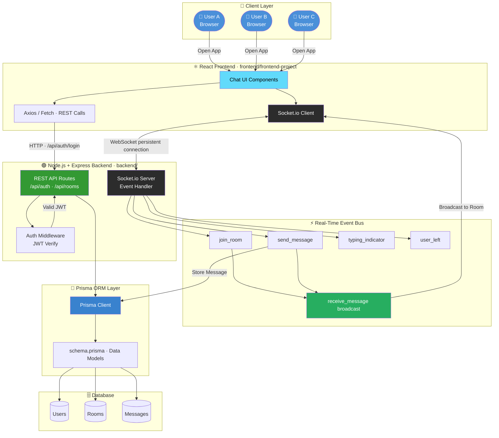
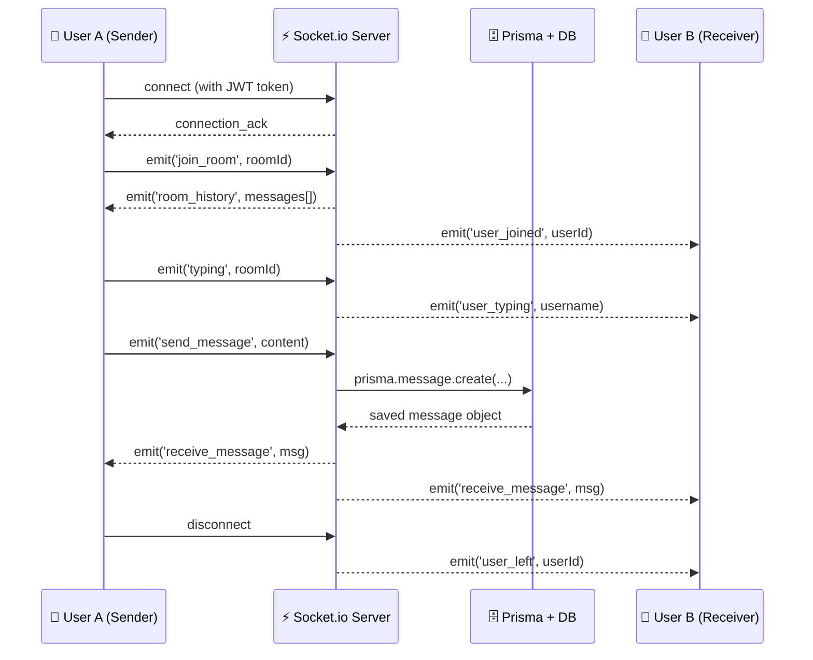

# 💬 Real-Time Chat Application

[](https://nodejs.org)
[](https://socket.io)
[](https://reactjs.org)
[](https://www.prisma.io)
[](https://developer.mozilla.org/en-US/docs/Web/JavaScript)
[](https://developer.mozilla.org/en-US/docs/Web/CSS)

> A **full-stack real-time chat application** powered by **Socket.io WebSockets** for instant bi-directional messaging, **Prisma ORM** for type-safe database access, and a clean React-based UI — built for production-level scalability and performance.

---

## 📌 Table of Contents

- [Overview](#-overview)
- [Tech Stack](#-tech-stack)
- [Architecture & Flow Diagram](#-architecture--flow-diagram)
- [WebSocket Event Flow](#-websocket-event-flow)
- [Features](#-features)
- [Project Structure](#-project-structure)
- [Getting Started](#-getting-started)
- [API & Socket Events Reference](#-api--socket-events-reference)
- [Key Design Decisions](#-key-design-decisions)

---

## 🔍 Overview

This project is a **real-time messaging platform** where users can join rooms, send messages instantly, and see live updates — all without page refreshes. It combines a traditional **REST API** (for auth and history) with **WebSocket connections** (for live messaging), giving the best of both worlds: reliability and speed.

The backend uses **Prisma ORM** for type-safe, schema-driven database operations, making it easy to scale the data layer without raw SQL errors.

---

## 🛠 Tech Stack

| Layer | Technology | Purpose |
|---|---|---|
| **Frontend** | React.js, CSS3 | UI rendering, real-time updates |
| **Backend** | Node.js, Express.js | REST API server |
| **Real-Time Engine** | Socket.io | Bi-directional WebSocket communication |
| **ORM** | Prisma | Type-safe database access & migrations |
| **Database** | PostgreSQL / SQLite (via Prisma) | Message & user persistence |
| **Scripting** | Python | Utility scripts / tooling |
| **Version Control** | Git & GitHub | Source management |

---

## 🗺 Architecture & Flow Diagram



---

## ⚡ WebSocket Event Flow



---

## ✨ Features

### 💬 Real-Time Messaging
- Instant message delivery using **Socket.io WebSockets** — zero polling, zero delays
- **Live typing indicators** — see when someone is composing a message
- **Room-based chat** — join specific rooms/channels to organize conversations
- **Broadcast on disconnect** — users are notified when someone leaves

### 🔐 Authentication & Security
- Secure user registration and login via REST API
- **JWT token passed during WebSocket handshake** to authenticate socket connections
- Protected REST endpoints for room management and message history

### 🗄 Data Persistence with Prisma
- All messages persisted via **Prisma ORM** — type-safe, migration-friendly
- **Chat history** fetched on room join via REST API
- Prisma schema enforces relational integrity between Users, Rooms, and Messages

### 🎨 Frontend Experience
- React-based responsive chat interface
- Real-time state updates driven by Socket.io client events
- Custom CSS for a clean, modern messaging look

---

## 📁 Project Structure

```
Chat-Application/
│
├── backend/                         # Node.js + Express + Socket.io server
│   ├── prisma/
│   │   └── schema.prisma            # Data models: User, Room, Message
│   ├── routes/
│   │   ├── auth.js                  # POST /api/auth/register, /login
│   │   └── rooms.js                 # GET /api/rooms, POST /api/rooms
│   ├── middleware/
│   │   └── authMiddleware.js        # JWT verification
│   ├── socket/
│   │   └── socketHandler.js         # All Socket.io event listeners
│   └── server.js                    # Express + Socket.io bootstrap
│
├── frontend/
│   └── frontend-project/            # React application
│       ├── src/
│       │   ├── components/
│       │   │   ├── ChatWindow.jsx   # Main messaging UI
│       │   │   ├── MessageBox.jsx   # Individual message bubble
│       │   │   ├── RoomList.jsx     # Sidebar: available rooms
│       │   │   └── TypingBadge.jsx  # Typing indicator
│       │   ├── context/
│       │   │   └── SocketContext.js # Global socket via Context API
│       │   ├── pages/
│       │   │   ├── Login.jsx
│       │   │   └── Chat.jsx
│       │   └── App.js
│       └── public/
│
├── *.py                             # Python utility / helper scripts
└── README.md
```

---

## 🚀 Getting Started

### Prerequisites
- Node.js (v16+)
- A database supported by Prisma (PostgreSQL recommended, SQLite for local dev)

### Backend Setup

```bash
# Navigate to backend
cd backend

# Install dependencies
npm install

# Configure environment variables
cp .env.example .env
# Edit .env: set DATABASE_URL, JWT_SECRET, PORT

# Run Prisma migrations
npx prisma migrate dev --name init

# Generate Prisma client
npx prisma generate

# Start the server
npm start
```

### Frontend Setup

```bash
cd frontend/frontend-project

npm install

npm start
```

The app runs on `http://localhost:3000` (frontend) and `http://localhost:5000` (backend + Socket.io).

---

## 📡 API & Socket Events Reference

### REST Endpoints

| Method | Endpoint | Description | Auth Required |
|--------|----------|-------------|:---:|
| `POST` | `/api/auth/register` | Register a new user | ❌ |
| `POST` | `/api/auth/login` | Login, receive JWT | ❌ |
| `GET` | `/api/rooms` | List all chat rooms | ✅ |
| `POST` | `/api/rooms` | Create a new room | ✅ |
| `GET` | `/api/rooms/:id/messages` | Fetch message history | ✅ |

### Socket.io Events

| Direction | Event | Payload | Description |
|-----------|-------|---------|-------------|
| Client → Server | `join_room` | `{ roomId }` | Join a chat room |
| Client → Server | `send_message` | `{ roomId, content }` | Send a message |
| Client → Server | `typing` | `{ roomId }` | Notify others of typing |
| Server → Client | `receive_message` | `{ id, content, sender, timestamp }` | Broadcast new message |
| Server → Client | `room_history` | `[messages]` | Past messages on room join |
| Server → Client | `user_typing` | `{ userId, username }` | Someone is composing |
| Server → Client | `user_joined` | `{ userId, username }` | New user joined room |
| Server → Client | `user_left` | `{ userId }` | User disconnected |

---

## 🧠 Key Design Decisions

| Decision | Rationale |
|---|---|
| **Socket.io over raw WebSockets** | Built-in reconnection, room namespacing, and HTTP long-polling fallback |
| **Prisma over raw SQL** | Type-safe queries, auto-generated client, painless schema migrations |
| **JWT in WebSocket handshake** | Secures socket connections at the protocol level without a separate auth layer |
| **REST for history, Sockets for live** | Clean separation of concerns — HTTP for CRUD, WebSocket for events |
| **React Context for Socket instance** | Avoids prop-drilling — single socket instance globally available across all components |

---

## 🤝 Contributing

Pull requests are welcome! Please open an issue first to discuss any significant changes.

---

## 👨‍💻 Author

**Ayush Garg**
- GitHub: [@ayushgarg2005](https://github.com/ayushgarg2005)

---

## 📄 License

This project is open source and available under the [MIT License](LICENSE).
